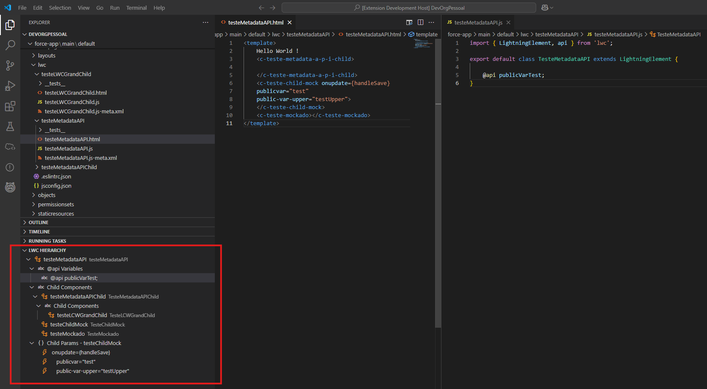

# LWC Dev Buddy README

The LWC Dev Buddy is an extension that helps you visualize and debug new or existing LWC structures in your Salesforce Organization.

## Features

The feature "Set this LWC as Main LWC" will create a tree with all the child components, variables and events of the specified LWC.

\!\[feature A\]\(img/Option_setLWCAsMainLWC.png\)

## Requirements

Only works in a Salesforce DX Project folder.

## Release Notes

### 0.0.0

First deployment

---

##

## Working with Markdown

You can author your README using Visual Studio Code. Here are some useful editor keyboard shortcuts:

* Split the editor (`Cmd+\` on macOS or `Ctrl+\` on Windows and Linux).
* Toggle preview (`Shift+Cmd+V` on macOS or `Shift+Ctrl+V` on Windows and Linux).
* Press `Ctrl+Space` (Windows, Linux, macOS) to see a list of Markdown snippets.

## For more information

* [Visual Studio Code's Markdown Support](http://code.visualstudio.com/docs/languages/markdown)
* [Markdown Syntax Reference](https://help.github.com/articles/markdown-basics/)

**Enjoy!**
